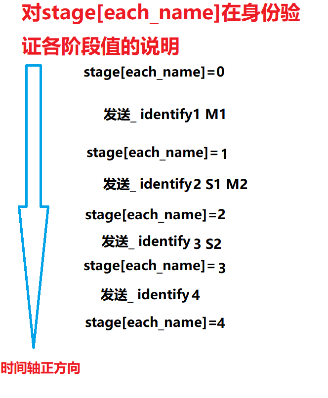

# 新的简单远程控制系统 V0.9
所运用的新技术（相比于本蒟蒻之前掌握的那么些可怜技术而言）包括：
* 运用HackChat机器人实现内网穿透（相当于利用hack.chat作为代理）
* 选择聊天室的私聊功能以避免来自第三方攻击
* 运用SHA-1哈希算法及RSA密钥系统$^1$进行安全验证与信息加密，以保证双方的身份得到可靠的认证且信息不会泄露

1 预定的V1.0版本暂不支持信息加密
## 身份验证过程简介
1. 用户输入```_ devices```指令$^2$，或是控制端启动时进行身份验证
2. 控制端（下简称R）向**每一个**$^3$可能的受控端（下简称E）发送一串随机明文M1，R向E发出```_ identify1 M1```控制指令
3. E用自己的密钥对M1签名（所有签名均使用UTF-8编码与SHA-1哈希算法）得到S1，同时生成随机明文M2来准备验证R的身份,以控制指令```_ identify2 S1 M2```回复给R
4. R通过已知的E的公钥对M1与S1进行验证以确定E的身份，同时用自己的密钥对M2签名得到S2。在确认E的身份后，以控制指令```_ identify3 S2```回复给E
5. E通过已知的R的公钥对M2与S2进行验证以确定R的身份。在确认R的身份后，向E发送```_ identify4```表示双方身份已验证完毕
6. ~~（此处本该画个图来直观解释的，但我没有时间哇！！！）~~

2 注意指令全部以```_ ```开头 **（下划线的后面有一个空格！！！）**
3 此处代码急需修补，本人~~蠢到家的~~写成对单人进行验证了
## TODO
* 把现有代码完善，发行V1.0（重点是修好身份验证的一大坨sh*t）

当前难点在于控制端输入```_ identify ```指令后，需要在双方的多个函数中相互进行交流，预计使用全局的```stage:dict={each_name:str : stage:int}```来表示对```each_name```的身份验证状态，具体说明见下
 